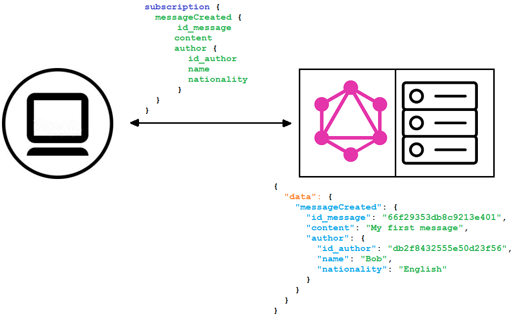
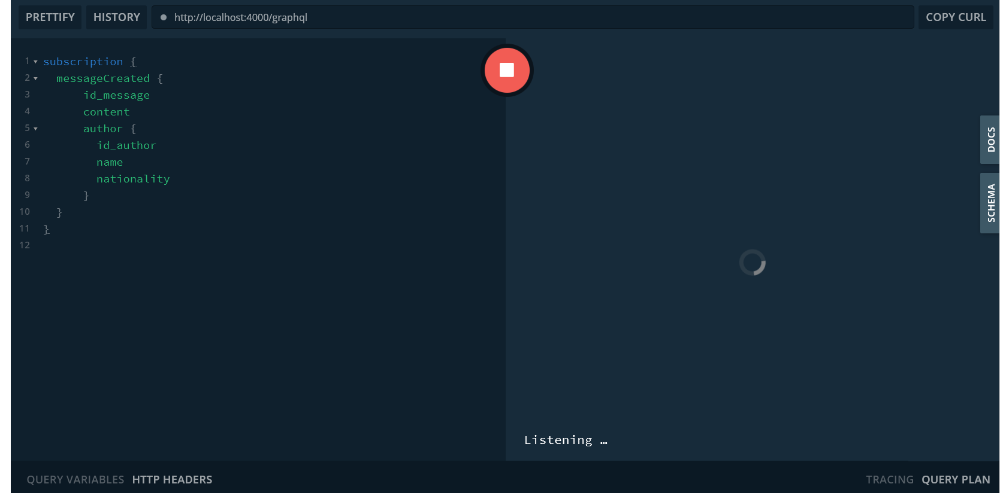
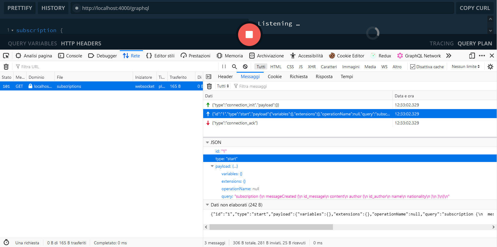
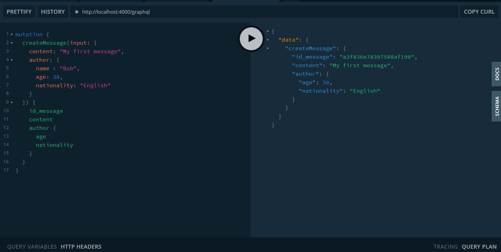
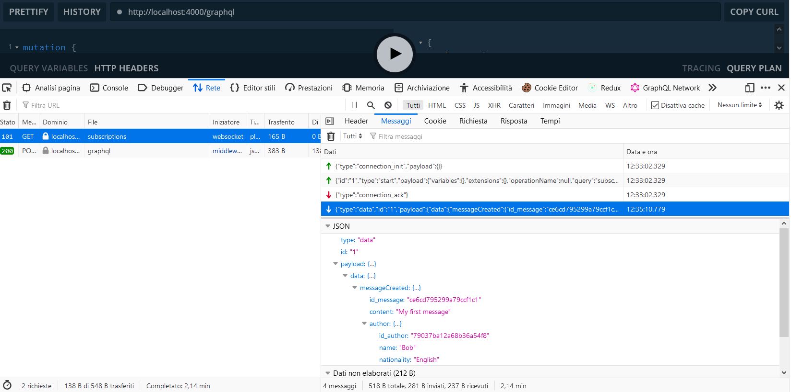
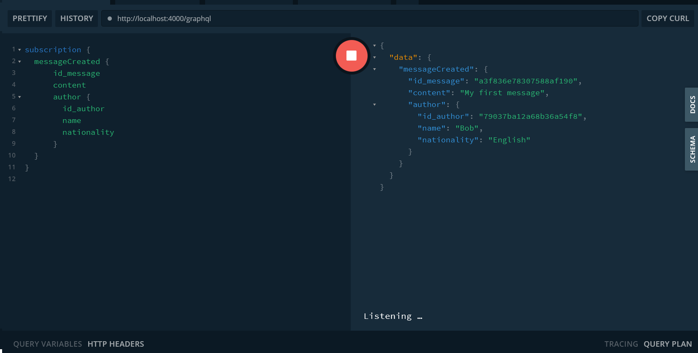

## GRAPHQL Subscriptions

 

Nei precedenti articoli abbiamo parlato delle `query` e `mutations` di GraqhQL e abbiamo implementato una API dimostrativa di un elementare servizio di messaggistica.

In questo articolo parleremo di un’altra funzionalità definita dalle specifiche GraphQL : le *subscriptions*.

Il codice presente in questo articolo si trova su *https://github.com/davideangelone/graphql-subscriptions*.

 

***WebSocket***

Immaginiamo che un utente del nostro servizio di messaggistica voglia essere avvisato in tempo reale quando qualcuno pubblica un nuovo messaggio, e voglia quindi recuperare il contenuto del messaggio stesso.

Per fare questo usando il protocollo http si potrebbe utilizzare un servizio di polling, che periodicamente interroga il server (ad esempio ogni secondo) e chiede se siano stati pubblicati nuovi messaggi. Sicuramente questa soluzioni può funzionare, ma produce un consumo di risorse e un traffico di rete inutile nella maggior parte del tempo, quando non ci sono nuovi messaggi.

D’altronde, il protocollo http si basa sul paradigma client-server che è unidirezionale: un client effettua una chiamata al server ed attende la risposta.

Una soluzione più efficiente è quella di fare in modo che sia il server a notificare al client quando è presente un nuovo messaggio, senza bisogno che il client effettui un polling periodico.

Per fare questo il protocollo http non è adatto, e dobbiamo utilizzare il protocollo *WebSocket*. Entrambi i protocolli si posizionano sopra il TCP.

Per utilizzare i WebSocket il client prima effettua una chiamata http di handshake ad un indirizzo WebSocket del server (comincia con `ws://` oppure `wss://`) chiedendo di cambiare il protocollo mediante la header `upgrade : websocket`. Il server risponde con codice `101` (*Switching protocol*) e quindi i successivi messaggi utilizzeranno il nuovo protocollo.

Le chiamate con WebSocket sono in “full-duplex” (bidirezionali), dove sia client che server possono inviare messaggi in contemporanea. Inoltre il WebSocket consente di inviare messaggi in broadcasting a più client simultaneamente.

 

***Subscriptions***

In GraphQL è possibile stabilire comunicazione realtime utilizzando le subscriptions mediante il protocollo WebSocket.

Quando un client è interessato ad essere notificato di un particolare evento, invia al server su un canale WebSocket una particolare query, denominata `subscription`, specificando a quale evento è interessato (nel nostro caso, la pubblicazione di un nuovo messaggio) e lo schema del messaggio di notifica richiesto.

Se la richiesta è valida e il server l’accetta allora viene attivata la subscription col client.

 

Quando l’evento di interesse del client si verifica, la query indicata nella subscription viene eseguita e viene inviato al client un messaggio con lo schema concordato in precedenza.

Chiaramente anche le subscriptions, come le `query` e `mutations`, devono essere dichiarate nello *schema* e necessitano di un *resolver*.

E’ possibile sia da parte del client che del server annullare la subscription precedentemente stabilita.


 


***Implementazione***

Nel precedente articolo avevamo visto un esempio di API dimostrativa di messaggistica utilizzando il package `express-graphql` di *npm* quale implementazione di un server GraphQL.

Tale implementazione tuttavia non supporta le subscriptions, per cui questa volta utilizzeremo `apollo-server-express` come server GraphQL. Tale server utilizza una sintassi leggermente differente, ma ovviamente entrambi rispettano le specifiche GraphQL.

I nuovi package richiesti sono :

```javascript
const { ApolloServer, gql, PubSub } = require('apollo-server-express');
const http = require('http');
```


e i nuovi oggetti sono :

```javascript
const pubsub = new PubSub();
const MESSAGE_CREATED_SUBSCRIPTION = 'Message_Created_Subscription';
```


dove `PubSub` è un oggetto che espone le API di *subscribe* e *publish*. Tale oggetto implementa il pattern di colloquio asincrono *publish-subscription*.

Secondo questo pattern un mittente (*publisher*) invia un messaggio ad un *dispatcher*, e tutti i client interessati possono abbonarsi (*subscribe*) a tale dispatcher per richiedere il recapito dei messaggi da esso raccolti.

I messaggi inviati dai *publisher* al dispatcher vengono indirizzati ad uno specifico canale, nel nostro caso identificato dalla costante `MESSAGE_CREATED_SUBSCRIPTION`.

 

Innanzi tutto  nello schema possiamo identificare un nuovo tipo Subscription :

```javascript
type Subscription {
  messageCreated: Message!
}
```

 

Come possiamo vedere dichiaramo la subscriptions denominata messageCreated , che ci dovrà notificare un oggetto di tipo Message.

 

Anche le subscriptions, come le query e mutations, necessitano di un *resolver* :

```javascript
Subscription: {

    messageCreated: {
      resolve: (message) => {
         return { 
            id_message : message.id_message,
            content : message.content,
               author : {
                  id_author : message.author.id_author,
                  name : message.author.name,
                  age : message.author.age,
                  nationality : message.author.nationality
               }
         };
      },
      
      subscribe: (parent, args, context, info) => {
         console.log('Subscription (' + info.fieldName + ') created');
         return pubsub.asyncIterator(MESSAGE_CREATED_SUBSCRIPTION);
      }

}
```


Come possiamo vedere il *resolver* della subscription prevede due proprietà :

- `resolve`, che restituisce l’oggetto di tipo `Message` che dovrà essere notificato al client
- `subscribe`, che inizializza la subscription stessa mediante un oggetto `AsyncIterator`, utilizzato da GraphQL per eseguire la notifica al client

 

Per il colloquio client-server, come abbiamo già detto, verrà utilizzato il protocollo WebSocket. Nel nostro caso quindi il dispatcher sarà attivo all’indirizzo `ws://localhost:4000/subscriptions`.

Di seguito i frammenti di codice più rilevanti :

```javascript
// Initialize the app
const PORT = 4000;
const app = express();
const path = '/graphql';
const subscriptionsPath = '/subscriptions';
 

const server = new ApolloServer({
 typeDefs,
 resolvers,
 playground: {
  endpoint: path,
  subscriptionEndpoint: subscriptionsPath,
 },

 …
   
});

 
server.applyMiddleware({ app, path });

const httpServer = http.createServer(app);
server.installSubscriptionHandlers(httpServer);


// Start the server
httpServer.listen(PORT, () => {
 console.log('Running a GraphQL API server at http://localhost:' + PORT + server.graphqlPath);
 console.log('Subscriptions ready at ws://localhost:' + PORT + server.subscriptionsPath);
});
```


*Diagramma GraphQL subscriptions :*

**

 

 

***Test***

Lanciamo il nostro server con `npm run start`, e otteniamo :

```
Running a GraphQL API server at http://localhost:4000/graphql
Subscriptions ready at ws://localhost:4000/subscriptions
Server starting up!
```


E’ attivo quindi sia il server GraphQL che il dispatcher per le subscriptions.

Per eseguire una subscription, utilizziamo un web client integrato in apollo-server-express. Si chiama *Playground*, ed è analogo a *GraphiQL* visto nel precedente articolo.

Andiamo quindi all’url http://localhost:4000/graphql e inseriamo la seguente subscription :



 

Vediamo che il *dispatcher* si mette in *listening* e sulla console appare qualcosa del genere:

```
Client [::1:57556] connected to subscriptions
Subscription (messageCreated) created
```


In questo modo il client `[::1:57556]` ha attivato la subscription `messageCreated` e quindi riceverà le relative notifiche.

Se analizziamo il traffico di rete sul browser, possiamo vedere le comunicazioni via WebSocket :



 

Successivamente apriamo un altro tab sul *Playground*, simulando una mutation da parte di un altro client :



 

Ispezionando il traffico di rete, possiamo verificare la risposta del *dispatcher*:



 

Ritornando nel primo tab delle subscriptions, possiamo vedere il messaggio notificato al client:



 

***Conclusioni***

In questo articolo abbiamo visto il meccanismo delle *subscription*, soluzione proposta da GraphQL come comunicazione realtime client-server utilizzando il protocollo WebSocket ed una implementazione del pattern *publisher-subscriber* (`PubSub`).

 

 

***Riferimenti***

<https://github.com/davideangelone/graphql-subscriptions>

<https://it.wikipedia.org/wiki/WebSocket>

<https://stackoverflow.blog/2019/12/18/websockets-for-fun-and-profit>

<https://github.com/apollographql/graphql-subscriptions>

<https://github.com/graphql/graphql-spec/blob/master/rfcs/Subscriptions.md>
